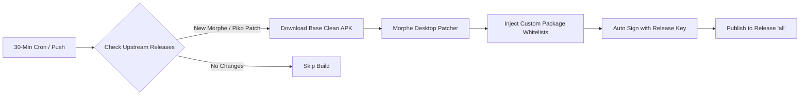

# ⚡ Morphe Automated Builds
### Curated, Ad-Free & Enhanced Android Apps by [Samuel Admand](https://github.com/SamuelAdmand)

  <b>High-performance, automated daily builds of your essential Android applications.</b> 
  Built clean with the modern <b>Morphe</b> patching engine. No bloat, no clutter, pure enhancement.

[✨ Supported Apps](#-supported-apps) • [🎧 Audio Whitelist Builds](#-oneplus--oppo--realme-audio-enhancement) • [🔑 MicroG Setup](#-prerequisites--microg) • [⚙️ How It Works](#️-automated-pipeline)

---

## 📱 Supported Apps

| App | Highlights | Last Updated | Latest Version | Direct Download |
| :--- | :--- | :--- | :--- | :--- |
| **YouTube** | Ad blocking, SponsorBlock, Return Dislike, Background Play, AMOLED | `2026-09-22 05:52 UTC` <!-- timestamp:youtube --> |  | [Jump to Downloads](#1--youtube) |
| **YouTube Music** | Audio ad blocking, background playback, lossless audio support | `2026-09-22 05:52 UTC` <!-- timestamp:youtube-music --> |  | [Jump to Downloads](#2--youtube-music) |
| **YouTube Music (Audio Whitelist)** | Renamed packages to unlock system Dolby Atmos & Dirac audio engines | `2026-09-22 05:52 UTC` <!-- timestamp:youtube-music-whitelist --> |  | [Jump to Downloads](#-oneplus--oppo--realme-audio-enhancement) |
| **Instagram** | Ad-free feed/reels, ghost mode, high-quality media download | `2026-09-22 05:52 UTC` <!-- timestamp:instagram --> |  | [Jump to Downloads](#3--instagram) |
| **Reddit** | Zero promoted ads, clean UI, video downloader, unlocked fonts | `2026-09-22 06:01 UTC` <!-- timestamp:reddit --> |  | [Jump to Downloads](#4--reddit) |

---

## 🚀 App Directory & Download Links

### 1. 🎬 YouTube

> 🕒 **Last Updated:** `2026-09-22 05:52 UTC` <!-- section-timestamp:youtube -->

Customized YouTube client with all modern quality-of-life enhancements.

> **Key Features:** Background playback, ad blocking, SponsorBlock skip segments, Return YouTube Dislike, swipe volume/brightness gestures, custom playback speeds, and pure AMOLED black theme.

| Architecture | Download Link | File Size / Format |
| :--- | :--- | :--- |
| **All Architectures (Universal)** | [📥 youtube-morphe.apk](../../releases/download/all/youtube-morphe.apk) | Standalone APK |
| **Arm64-v8a** (Most Modern Phones) | [📥 youtube-arm64-v8a-morphe.apk](../../releases/download/all/youtube-arm64-v8a-morphe.apk) | Optimized APK |
| **Armeabi-v7a** (Older 32-bit Devices) | [📥 youtube-armeabi-v7a-morphe.apk](../../releases/download/all/youtube-armeabi-v7a-morphe.apk) | Standalone APK |
| **x86** (Emulators / Android PCs) | [📥 youtube-x86-morphe.apk](../../releases/download/all/youtube-x86-morphe.apk) | Standalone APK |
| **x86_64** (64-bit Emulators / ChromeOS) | [📥 youtube-x86_64-morphe.apk](../../releases/download/all/youtube-x86_64-morphe.apk) | Standalone APK |

*Note: Requires [MicroG RE](#-prerequisites--microg) installed to sign in to your Google account.*

---

### 2. 🎵 YouTube Music

> 🕒 **Last Updated:** `2026-09-22 05:52 UTC` <!-- section-timestamp:youtube-music -->

Ad-free music streaming with background playback and unrestricted playback queue controls.

> **Key Features:** Background audio playback with screen off, audio and video ads removed, permanent audio-only toggle, remembered repeat/shuffle states, and custom branding.

#### Standard Package (`com.google.android.apps.youtube.music`)

| Architecture | Download Link |
| :--- | :--- |
| **Arm64-v8a** (Recommended) | [📥 youtube-music-arm64-v8a-morphe.apk](../../releases/download/all/youtube-music-arm64-v8a-morphe.apk) |
| **Armeabi-v7a** (Older Devices) | [📥 youtube-music-armeabi-v7a-morphe.apk](../../releases/download/all/youtube-music-armeabi-v7a-morphe.apk) |

---

### 🎧 OnePlus / Oppo / Realme Audio Enhancement
#### *Whitelisted Package Builds for System Dolby Atmos, Dirac & O-Reality*

> 🕒 **Last Updated:** `2026-09-22 05:52 UTC` <!-- section-timestamp:youtube-music-whitelist -->

> [!TIP]
> ### 💡 Why do these builds exist?
> On **OnePlus**, **Oppo**, **Realme**, and **ColorOS / OxygenOS** devices, hardware-level audio processing (such as **Dolby Atmos**, **Dirac Audio Tuner**, and **O-Reality Audio Equalizers**) is hard-coded to only trigger when the active media player matches an internal system whitelist.
>
> Standard YouTube Music does **not** trigger these hardware DSPs.
> 
> These specialized builds use Morphe's app cloning engine to re-target YouTube Music under whitelisted package identities. Once installed, your device's audio settings immediately recognize the app, providing **full system equalizer effects, spatial audio, and Dolby Atmos audio enhancements!**

<b>🔥 Click to view Whitelisted Package Downloads</b>

 

#### 1. QQ Music Identity (`com.tencent.qqmusic`)
*Triggers Dirac Audio & Dolby Atmos on virtually all ColorOS & OxygenOS releases.*
| Architecture | Direct APK Download |
| :--- | :--- |
| **Arm64-v8a** | [📥 youtube-music-arm64-v8a-qqmusic-morphe.apk](../../releases/download/all/youtube-music-arm64-v8a-qqmusic-morphe.apk) |
| **Armeabi-v7a** | [📥 youtube-music-armeabi-v7a-qqmusic-morphe.apk](../../releases/download/all/youtube-music-armeabi-v7a-qqmusic-morphe.apk) |

#### 2. Kugou Lite Identity (`com.kugou.android.lite`)
*Secondary audio whitelist profile with low-overhead system equalizer hooks.*
| Architecture | Direct APK Download |
| :--- | :--- |
| **Arm64-v8a** | [📥 youtube-music-arm64-v8a-kugou-lite-morphe.apk](../../releases/download/all/youtube-music-arm64-v8a-kugou-lite-morphe.apk) |
| **Armeabi-v7a** | [📥 youtube-music-armeabi-v7a-kugou-lite-morphe.apk](../../releases/download/all/youtube-music-armeabi-v7a-kugou-lite-morphe.apk) |

#### 3. Kugou Standard Identity (`com.kugou.android`)
*Primary Kugou audio whitelist profile for ColorOS, OxygenOS, and RealmeUI.*
| Architecture | Direct APK Download |
| :--- | :--- |
| **Arm64-v8a** | [📥 youtube-music-arm64-v8a-kugou-morphe.apk](../../releases/download/all/youtube-music-arm64-v8a-kugou-morphe.apk) |
| **Armeabi-v7a** | [📥 youtube-music-armeabi-v7a-kugou-morphe.apk](../../releases/download/all/youtube-music-armeabi-v7a-kugou-morphe.apk) |

#### 4. Kugou Viper Identity (`com.kugou.viper`)
*Targeted for devices supporting Viper / Dirac HD hardware sound processing.*
| Architecture | Direct APK Download |
| :--- | :--- |
| **Arm64-v8a** | [📥 youtube-music-arm64-v8a-kugou-viper-morphe.apk](../../releases/download/all/youtube-music-arm64-v8a-kugou-viper-morphe.apk) |
| **Armeabi-v7a** | [📥 youtube-music-armeabi-v7a-kugou-viper-morphe.apk](../../releases/download/all/youtube-music-armeabi-v7a-kugou-viper-morphe.apk) |

---

### 3. 📸 Instagram

> 🕒 **Last Updated:** `2026-09-22 05:52 UTC` <!-- section-timestamp:instagram -->

Enhanced Instagram client built with the Morphe MPP pipeline.

> **Key Features:** Complete ad removal (sponsored posts, stories ads, and suggested reel ads removed), Ghost Mode (view direct messages and watch stories without read receipts), direct high-resolution video and photo downloads, and full AMOLED dark mode.

| Architecture | Direct APK Download | Format |
| :--- | :--- | :--- |
| **Arm64-v8a** | [📥 instagram-arm64-v8a-morphe.apk](../../releases/download/all/instagram-arm64-v8a-morphe.apk) | Standalone APK |

---

### 4. 🤖 Reddit

> 🕒 **Last Updated:** `2026-09-22 06:01 UTC` <!-- section-timestamp:reddit -->

Distraction-free, high-speed Reddit experience.

> **Key Features:** Promoted ads completely hidden, tracking parameters stripped from shared links, native video download button, and sanitized UI.

| Architecture | Direct APK Download | Format |
| :--- | :--- | :--- |
| **All Architectures (Universal)** | [📥 reddit-morphe.apk](../../releases/download/all/reddit-morphe.apk) | Standalone APK |
| **Arm64-v8a** | [📥 reddit-arm64-v8a-morphe.apk](../../releases/download/all/reddit-arm64-v8a-morphe.apk) | Optimized APK |

---

## 🔑 Prerequisites & MicroG

If you use **YouTube** or **YouTube Music**, Google services authentication requires a lightweight GmsCore provider.

> [!IMPORTANT]
> Install **MicroG RE** before opening YouTube or YouTube Music:
> 
> 👉 **[Download MicroG RE (Latest Release)](https://github.com/MorpheApp/MicroG-RE/releases/latest)**
>
> 1. Download and install `microg-re.apk`.
> 2. Open MicroG settings, disable battery optimization for MicroG, and sign in with your Google account.
> 3. Launch YouTube or YouTube Music. Your playlists, history, and subscriptions will sync automatically.

---

## ⚙️ Automated Pipeline

- **Real-Time Automated Checks:** Automated GitHub Actions monitor upstream `MorpheApp` and `crimera` repositories every 30 minutes for new patches and rebuilds automatically.

- **Safe & Clean:** Source APKs are fetched directly from trusted APKMirror mirrors and verified with clean checksums before patching.
- **Single Rolling Release:** All builds are published under the unified [`all`](../../releases/tag/all) release tag so your download URLs never break.

---

## 🌟 Credits & Acknowledgments

- **[Morphe](https://github.com/MorpheApp)** — Modern Android bytecode patching engine, desktop CLI, and core patches.
- **[Piko](https://github.com/crimera/piko)** — Morphe-compatible patch bundle for Instagram.
- **[MicroG](https://github.com/MorpheApp/MicroG-RE)** — Open-source Google Play Services re-implementation.

---

  Maintained by <b><a href="https://github.com/SamuelAdmand">Samuel Admand</a></b> • Built with GitHub Actions

