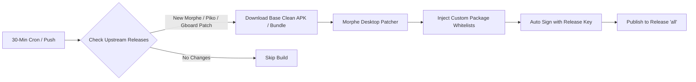

# ⚡ Morphe Automated Builds
### Curated, Ad-Free & Enhanced Android Apps by [Samuel Admand](https://github.com/SamuelAdmand)

  <b>High-performance, automated daily builds of your essential Android applications.</b> 
  Built clean with the modern <b>Morphe</b> patching engine. No bloat, no clutter, pure enhancement.

[✨ Supported Apps](#-supported-apps) • [🎧 Audio Whitelist Builds](#-oneplus--oppo--realme-audio-enhancement) • [🔑 MicroG Setup](#-prerequisites--microg) • [⚙️ How It Works](#️-automated-pipeline)

---

## 📱 Supported Apps

| App | Base App Version | Patch Version | Last Updated | Highlights | Direct Download |
| :--- | :--- | :--- | :--- | :--- | :--- |
| **YouTube** | `v21.16.256` <!-- app-version:youtube --> | `Morphe v1.45.0` <!-- patch-version:youtube --> | `2026-10-04 08:20 UTC` <!-- timestamp:youtube --> | Ad blocking, SponsorBlock, Return Dislike, Background Play, AMOLED | [Jump to Downloads](#1--youtube) |
| **YouTube (Audio Whitelist)** | `v21.16.256` <!-- app-version:youtube-whitelist --> | `Morphe v1.45.0` <!-- patch-version:youtube-whitelist --> | `2026-10-04 08:20 UTC` <!-- timestamp:youtube-whitelist --> | Renamed packages to unlock system Dolby Atmos & Dirac audio engines | [Jump to Downloads](#-oneplus--oppo--realme-audio-enhancement) |
| **YouTube Music** | `v9.15.51` <!-- app-version:youtube-music --> | `Morphe v1.45.0` <!-- patch-version:youtube-music --> | `2026-10-04 08:15 UTC` <!-- timestamp:youtube-music --> | Audio ad blocking, background playback, lossless audio support | [Jump to Downloads](#2--youtube-music) |
| **YouTube Music (Audio Whitelist)** | `v9.15.51` <!-- app-version:youtube-music-whitelist --> | `Morphe v1.45.0` <!-- patch-version:youtube-music-whitelist --> | `2026-10-04 08:15 UTC` <!-- timestamp:youtube-music-whitelist --> | Renamed packages to unlock system Dolby Atmos & Dirac audio engines | [Jump to Downloads](#-oneplus--oppo--realme-audio-enhancement) |
| **Instagram** | `v439.0.0.37.89` <!-- app-version:instagram --> | `Piko v3.9.0` <!-- patch-version:instagram --> | `2026-10-04 08:08 UTC` <!-- timestamp:instagram --> | Ad-free feed/reels, ghost mode, high-quality media download | [Jump to Downloads](#3--instagram) |
| **Reddit** | `v2026.24.0` <!-- app-version:reddit --> | `Morphe v1.45.0` <!-- patch-version:reddit --> | `2026-10-04 18:03 UTC` <!-- timestamp:reddit --> | Zero promoted ads, clean UI, video downloader, unlocked fonts | [Jump to Downloads](#4--reddit) |
| **Gboard** | `v18.0.3.954559732` <!-- app-version:gboard --> | `Gboard Patches v3.12.0` <!-- patch-version:gboard --> | `2026-10-04 18:02 UTC` <!-- timestamp:gboard --> | Web Clipboard, long-press editing, symbols, calculator, custom themes, feature unlocks | [Jump to Downloads](#5--gboard) |

---

## 🚀 App Directory & Download Links

### 1. 🎬 YouTube

> 🕒 **Last Updated:** `2026-10-04 08:20 UTC` <!-- section-timestamp:youtube --> • 📦 **Base App Version:** `v21.16.256` <!-- section-app-version:youtube --> • 🧩 **Patch Version:** `Morphe v1.45.0` <!-- section-patch-version:youtube -->

Customized YouTube client with all modern quality-of-life enhancements.

> **Key Features:** Background playback, ad blocking, SponsorBlock skip segments, Return YouTube Dislike, swipe volume/brightness gestures, custom playback speeds, and pure AMOLED black theme.

| Architecture | Download Link | File Size / Format |
| :--- | :--- | :--- |
| **All Architectures (Universal)** | [📥 youtube-morphe.apk](../../releases/download/all/youtube-morphe.apk) | Standalone APK |
| **Arm64-v8a** (Most Modern Phones) | [📥 youtube-arm64-v8a-morphe.apk](../../releases/download/all/youtube-arm64-v8a-morphe.apk) | Optimized APK |
| **Armeabi-v7a** (Older 32-bit Devices) | [📥 youtube-armeabi-v7a-morphe.apk](../../releases/download/all/youtube-armeabi-v7a-morphe.apk) | Standalone APK |
| **x86** (Emulators / Android PCs) | [📥 youtube-x86-morphe.apk](../../releases/download/all/youtube-x86-morphe.apk) | Standalone APK |
| **x86_64** (64-bit Emulators / ChromeOS) | [📥 youtube-x86_64-morphe.apk](../../releases/download/all/youtube-x86_64-morphe.apk) | Standalone APK |

*Note: Requires [MicroG RE](#-prerequisites--microg) installed to sign in to your Google account.*

---

### 2. 🎵 YouTube Music

> 🕒 **Last Updated:** `2026-10-04 08:15 UTC` <!-- section-timestamp:youtube-music --> • 📦 **Base App Version:** `v9.15.51` <!-- section-app-version:youtube-music --> • 🧩 **Patch Version:** `Morphe v1.45.0` <!-- section-patch-version:youtube-music -->

Ad-free music streaming with background playback and unrestricted playback queue controls.

> **Key Features:** Background audio playback with screen off, audio and video ads removed, permanent audio-only toggle, remembered repeat/shuffle states, and custom branding.

#### Standard Package (`com.google.android.apps.youtube.music`)

| Architecture | Download Link |
| :--- | :--- |
| **Arm64-v8a** (Recommended) | [📥 youtube-music-arm64-v8a-morphe.apk](../../releases/download/all/youtube-music-arm64-v8a-morphe.apk) |
| **Armeabi-v7a** (Older Devices) | [📥 youtube-music-armeabi-v7a-morphe.apk](../../releases/download/all/youtube-music-armeabi-v7a-morphe.apk) |

---

### 🎧 OnePlus / Oppo / Realme Audio Enhancement
#### *Whitelisted Package Builds for System Dolby Atmos, Dirac & O-Reality*

<<<<<<< HEAD
> 🕒 **Last Updated:** `2026-10-04 08:15 UTC` <!-- section-timestamp:youtube-music-whitelist --> • 📦 **Base App Version:** `v9.15.51` <!-- section-app-version:youtube-music-whitelist --> • 🧩 **Patch Version:** `Morphe v1.45.0` <!-- section-patch-version:youtube-music-whitelist -->
=======
> 🕒 **Last Updated:** `2026-10-04 08:15 UTC` <!-- section-timestamp:youtube-music-whitelist --> • 📦 **Base App Version:** `v21.16.256` / `v9.15.51` • 🧩 **Patch Version:** `Morphe v1.45.0` <!-- section-patch-version:youtube-whitelist -->
>>>>>>> e7cd905 (feat(youtube): add OnePlus/Oppo audio whitelist package variants)

> [!TIP]
> ### 💡 Why do these builds exist?
> On **OnePlus**, **Oppo**, **Realme**, and **ColorOS / OxygenOS** devices, hardware-level audio processing (such as **Dolby Atmos**, **Dirac Audio Tuner**, and **O-Reality Audio Equalizers**) is hard-coded to only trigger when the active media player matches an internal system whitelist.
>
> Standard YouTube and YouTube Music do **not** trigger these hardware DSPs.
> 
> These specialized builds use Morphe's app cloning engine to re-target **YouTube** and **YouTube Music** under whitelisted package identities. Once installed, your device's audio settings immediately recognize the app, providing **full system equalizer effects, spatial audio, and Dolby Atmos audio enhancements!**

<b>🎬 Click to view YouTube Whitelisted Package Downloads</b>

 

#### 1. QQ Music Identity (`com.tencent.qqmusic`)
*Triggers Dirac Audio & Dolby Atmos on virtually all ColorOS & OxygenOS releases.*
| Architecture | Direct APK Download |
| :--- | :--- |
| **Arm64-v8a** | [📥 youtube-arm64-v8a-qqmusic-morphe.apk](../../releases/download/all/youtube-arm64-v8a-qqmusic-morphe.apk) |
| **Armeabi-v7a** | [📥 youtube-armeabi-v7a-qqmusic-morphe.apk](../../releases/download/all/youtube-armeabi-v7a-qqmusic-morphe.apk) |

#### 2. Kugou Lite Identity (`com.kugou.android.lite`)
*Secondary audio whitelist profile with low-overhead system equalizer hooks.*
| Architecture | Direct APK Download |
| :--- | :--- |
| **Arm64-v8a** | [📥 youtube-arm64-v8a-kugou-lite-morphe.apk](../../releases/download/all/youtube-arm64-v8a-kugou-lite-morphe.apk) |
| **Armeabi-v7a** | [📥 youtube-armeabi-v7a-kugou-lite-morphe.apk](../../releases/download/all/youtube-armeabi-v7a-kugou-lite-morphe.apk) |

#### 3. Kugou Standard Identity (`com.kugou.android`)
*Primary Kugou audio whitelist profile for ColorOS, OxygenOS, and RealmeUI.*
| Architecture | Direct APK Download |
| :--- | :--- |
| **Arm64-v8a** | [📥 youtube-arm64-v8a-kugou-morphe.apk](../../releases/download/all/youtube-arm64-v8a-kugou-morphe.apk) |
| **Armeabi-v7a** | [📥 youtube-armeabi-v7a-kugou-morphe.apk](../../releases/download/all/youtube-armeabi-v7a-kugou-morphe.apk) |

#### 4. Kugou Viper Identity (`com.kugou.viper`)
*Targeted for devices supporting Viper / Dirac HD hardware sound processing.*
| Architecture | Direct APK Download |
| :--- | :--- |
| **Arm64-v8a** | [📥 youtube-arm64-v8a-kugou-viper-morphe.apk](../../releases/download/all/youtube-arm64-v8a-kugou-viper-morphe.apk) |
| **Armeabi-v7a** | [📥 youtube-armeabi-v7a-kugou-viper-morphe.apk](../../releases/download/all/youtube-armeabi-v7a-kugou-viper-morphe.apk) |

<b>🎵 Click to view YouTube Music Whitelisted Package Downloads</b>

 

#### 1. QQ Music Identity (`com.tencent.qqmusic`)
*Triggers Dirac Audio & Dolby Atmos on virtually all ColorOS & OxygenOS releases.*
| Architecture | Direct APK Download |
| :--- | :--- |
| **Arm64-v8a** | [📥 youtube-music-arm64-v8a-qqmusic-morphe.apk](../../releases/download/all/youtube-music-arm64-v8a-qqmusic-morphe.apk) |
| **Armeabi-v7a** | [📥 youtube-music-armeabi-v7a-qqmusic-morphe.apk](../../releases/download/all/youtube-music-armeabi-v7a-qqmusic-morphe.apk) |

#### 2. Kugou Lite Identity (`com.kugou.android.lite`)
*Secondary audio whitelist profile with low-overhead system equalizer hooks.*
| Architecture | Direct APK Download |
| :--- | :--- |
| **Arm64-v8a** | [📥 youtube-music-arm64-v8a-kugou-lite-morphe.apk](../../releases/download/all/youtube-music-arm64-v8a-kugou-lite-morphe.apk) |
| **Armeabi-v7a** | [📥 youtube-music-armeabi-v7a-kugou-lite-morphe.apk](../../releases/download/all/youtube-music-armeabi-v7a-kugou-lite-morphe.apk) |

#### 3. Kugou Standard Identity (`com.kugou.android`)
*Primary Kugou audio whitelist profile for ColorOS, OxygenOS, and RealmeUI.*
| Architecture | Direct APK Download |
| :--- | :--- |
| **Arm64-v8a** | [📥 youtube-music-arm64-v8a-kugou-morphe.apk](../../releases/download/all/youtube-music-arm64-v8a-kugou-morphe.apk) |
| **Armeabi-v7a** | [📥 youtube-music-armeabi-v7a-kugou-morphe.apk](../../releases/download/all/youtube-music-armeabi-v7a-kugou-morphe.apk) |

#### 4. Kugou Viper Identity (`com.kugou.viper`)
*Targeted for devices supporting Viper / Dirac HD hardware sound processing.*
| Architecture | Direct APK Download |
| :--- | :--- |
| **Arm64-v8a** | [📥 youtube-music-arm64-v8a-kugou-viper-morphe.apk](../../releases/download/all/youtube-music-arm64-v8a-kugou-viper-morphe.apk) |
| **Armeabi-v7a** | [📥 youtube-music-armeabi-v7a-kugou-viper-morphe.apk](../../releases/download/all/youtube-music-armeabi-v7a-kugou-viper-morphe.apk) |

---

### 3. 📸 Instagram

> 🕒 **Last Updated:** `2026-10-04 08:08 UTC` <!-- section-timestamp:instagram --> • 📦 **Base App Version:** `v439.0.0.37.89` <!-- section-app-version:instagram --> • 🧩 **Patch Version:** `Piko v3.9.0` <!-- section-patch-version:instagram -->

Enhanced Instagram client built with the Morphe MPP pipeline.

> **Key Features:** Complete ad removal (sponsored posts, stories ads, and suggested reel ads removed), Ghost Mode (view direct messages and watch stories without read receipts), direct high-resolution video and photo downloads, and full AMOLED dark mode.

| Architecture | Direct APK Download | Format |
| :--- | :--- | :--- |
| **Arm64-v8a** | [📥 instagram-arm64-v8a-morphe.apk](../../releases/download/all/instagram-arm64-v8a-morphe.apk) | Standalone APK |

---

### 4. 🤖 Reddit

> 🕒 **Last Updated:** `2026-10-04 18:03 UTC` <!-- section-timestamp:reddit --> • 📦 **Base App Version:** `v2026.24.0` <!-- section-app-version:reddit --> • 🧩 **Patch Version:** `Morphe v1.45.0` <!-- section-patch-version:reddit -->

Distraction-free, high-speed Reddit experience.

> **Key Features:** Promoted ads completely hidden, tracking parameters stripped from shared links, native video download button, and sanitized UI.

| Architecture | Direct APK Download | Format |
| :--- | :--- | :--- |
| **All Architectures (Universal)** | [📥 reddit-morphe.apk](../../releases/download/all/reddit-morphe.apk) | Standalone APK |
| **Arm64-v8a** | [📥 reddit-arm64-v8a-morphe.apk](../../releases/download/all/reddit-arm64-v8a-morphe.apk) | Optimized APK |

---

### 5. ⌨️ Gboard

> 🕒 **Last Updated:** `2026-10-04 18:02 UTC` <!-- section-timestamp:gboard --> • 📦 **Base App Version:** `v18.0.3.954559732` <!-- section-app-version:gboard --> • 🧩 **Patch Version:** `Gboard Patches v3.12.0` <!-- section-patch-version:gboard -->

Patched Google Keyboard (Gboard) powered by **[jasonwu1994/Gboard-patches](https://github.com/jasonwu1994/Gboard-patches)** with practical productivity upgrades, developer tools, custom themes, and Taiwan-focused Zhuyin enhancements.

> **Key Features:** Web Clipboard (LAN PC-to-phone clipboard sync), Long-Press Editing Shortcuts (Select All, Undo, Cut, Copy, Paste, Redo), Toolbar Editing Buttons, Inline Simple Calculator, Custom Theme ZIP imports, Incognito Mode Toggle, Custom Symbols tab, and Gboard hidden feature unlocks (AI Writing Tools, Advanced Voice Typing, OCR / Scan Text, Key Shape Selection, Flag Editor & Developer Options).

| Architecture | Direct APK Download | Format |
| :--- | :--- | :--- |
| **Arm64-v8a** | [📥 gboard-arm64-v8a-morphe.apk](../../releases/download/all/gboard-arm64-v8a-morphe.apk) | Standalone APK (patched from official App Bundle) |

---

## 🔑 Prerequisites & MicroG

If you use **YouTube** or **YouTube Music**, Google services authentication requires a lightweight GmsCore provider.

> [!IMPORTANT]
> Install **MicroG RE** before opening YouTube or YouTube Music:
> 
> 👉 **[Download MicroG RE (Latest Release)](https://github.com/MorpheApp/MicroG-RE/releases/latest)**
>
> 1. Download and install `microg-re.apk`.
> 2. Open MicroG settings, disable battery optimization for MicroG, and sign in with your Google account.
> 3. Launch YouTube or YouTube Music. Your playlists, history, and subscriptions will sync automatically.

---

## ⚙️ Automated Pipeline

```mermaid
flowchart LR
    A[30-Min Cron / Push] --> B{Check Upstream Releases}
    B -->|New Morphe / Piko / Gboard Patch| C[Download Base Clean APK / Bundle]
    B -->|No Changes| D[Skip Build]
    C --> E[Morphe Desktop Patcher]
    E --> F[Inject Custom Package Whitelists]
    F --> G[Auto Sign with Release Key]
    G --> H[Publish to Release 'all']
```

- **Real-Time Automated Checks:** Automated GitHub Actions monitor upstream `MorpheApp`, `crimera`, and `jasonwu1994` repositories every 30 minutes for new patches and rebuilds automatically.

- **Safe & Clean:** Source APKs and App Bundles are fetched directly from trusted APKMirror mirrors and verified with clean checksums before patching.
- **Single Rolling Release:** All builds are published under the unified [`all`](../../releases/tag/all) release tag so your download URLs never break.

---

## 🌟 Credits & Acknowledgments

- **[Morphe](https://github.com/MorpheApp)** — Modern Android bytecode patching engine, desktop CLI, and core patches.
- **[Piko](https://github.com/crimera/piko)** — Morphe-compatible patch bundle for Instagram.
- **[Gboard Patches](https://github.com/jasonwu1994/Gboard-patches)** — Morphe-compatible patch bundle for Gboard by [jasonwu1994](https://github.com/jasonwu1994).
- **[MicroG](https://github.com/MorpheApp/MicroG-RE)** — Open-source Google Play Services re-implementation.

---

  Maintained by <b><a href="https://github.com/SamuelAdmand">Samuel Admand</a></b> • Built with GitHub Actions

